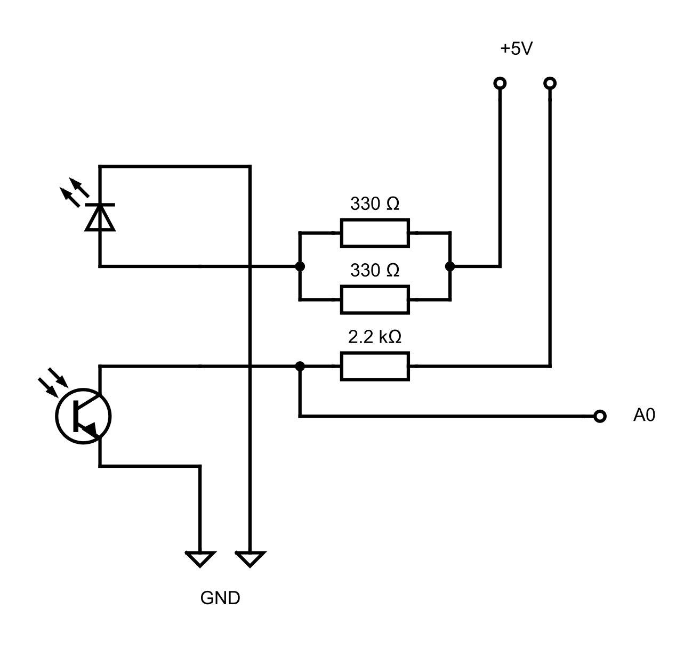

# arduino-ean8
This repository contains everything related to the EAN-8 barcode scanner project.

### Setup
The scanner uses a Phototransitor combined with a LED to read an EAN-8 barcode while
moving across it at a constant speed. There is some additional components needed
to read the brightness values as analog voltages. Use following circuit drawing as a template:
<p align="center">

</p>

### Usage
For simplicity, it is recommended to use platformio to manage this project.
Initialize the project with the following command:
```
make init
```
Once the project is ready, you can compile and upload the binary to your arduino
as follows:
```
make upload
```
Make sure to keep the sensor on a white underground and not in the air at all times.
Once you move across a barcode, the arduino will automatically detect and attempt to
decode it, outputting the result through serial communication. The bigger the barcode,
the better the device works. Aim for a speed which crosses the barcode in about 1-2 seconds.
Much slower movement will fill the buffer too fast, much faster will cause misinterpretations
due to inaccurate sensor data. If the sensor fails to read the barcode, it will notify this.

### Developement

To speed up developement, the processing of barcode data was split up in several functions,
provided by the [processing.h](include/processing.h) header. To test functionality, first
generate test data of a barcode, in this case one containing 6583 and 3254:
```
./scripts/generate 0101010000100111010010001000010101010111101001001101100010100011010 5
```
The 5 indicates the scaling applied to every bit (meaning 1 bit equals 5 datapoints).
This script will write the generated datapoints into the [test program](test/main.cpp),
which can be executed using
```
make test
```
This way, all the editing during development happens inside the [processing source file](src/processing.cpp),
and does so in an efficient and clean way.